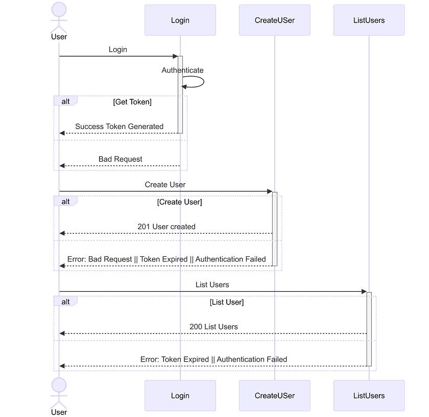

# NisumRestAPI

This project is oriented to register users as a code evaluation for Nisum.

## Resources

This project uses an H2-embedded database to be tested, the endpoints to use are:

- http://localhost:8080
- http://localhost:8080/login
- http://localhost:8080/users
- http://localhost:8080/user-creation
- database location: http://localhost:8080/h2-console  user: nisum, password: nisum, jdbc url: jdbc:h2:mem:nisumtestdb
- Swagger UI: http://localhost:8080/swagger-ui.html#/

## Running

Clone and open the project with the preferred IDE and once it is open run the following command in  the terminal :

```sh
./gradlew bootRun
```
For request the main endpoint:
```
http://localhost:8080
```

if the service is running properly the response must be **Nisum API works!** 

## Validations

- Not empty fields are allowed
- Email field must match **xxxx@xxxx.xx** format
- Repeated emails are not allowed
- Password field must have at least one number

## Preconditions
- Get token before call business endpoints
- Token expires 1 minute after creation

## Expected Result
| Request                                 |
|-----------------------------------------|
| Post Method http://localhost:8080/login ||
```javascript
{
    "name": "Jhon Doe",
    "email": "jhon32@gmail.com",
    "password": "12345"
}
```

| Response  |
| ------  |
```javascript
{{token}}
```
| Request                                                    |
|------------------------------------------------------------|
| Post Method http://localhost:8080/user-creation            ||
| Set Authorization Type "Bearer Token" with value {{token}} |
```javascript
{
    "name": "Juan Rodriguez",
    "email": "juan@rodriguez.org",
    "password": "hunter2",
    "phones": [
        {
            "number": "1234567",
            "cityCode": "1",
            "countryCode": "57"
        }
    ]
}
```

| Response  |
| ------  |
```javascript
{
    "message": "Success",
    "content": {
        "user": {
            "id": "784be662-c05c-42fb-a658-c56f3f6fc4a3",
            "name": "Juan Rodriguez",
            "email": "juan@rodriguez.org",
            "password": "hunter2",
            "phones": [
                {
                    "number": "1234567",
                    "cityCode": "1",
                    "countryCode": "57"
                }
            ]
        },
        "created": "Wed Jan 25 20:20:46 COT 2023",
        "modified": "Wed Jan 25 20:20:46 COT 2023",
        "lastLogin": "Wed Jan 25 20:20:46 COT 2023",
        "token": "f5f519ed-4d0b-4cd3-add4-24b62cf9b08f",
        "active": false
    }
}
```

| Request                                                    |
|------------------------------------------------------------|
| Get Method http://localhost:8080/users                     ||
| Set Authorization Type "Bearer Token" with value {{token}} |
```javascript

```
| Response  |
| ------  |
```javascript
[
    {
        "user": {
            "id": "acde070d-8c4c-4f0d-9d8a-162843c10333",
            "name": "Jhon Doe",
            "email": "jhon32@gmail.com",
            "password": "12345",
            "phones": [
                {
                    "number": "3345251",
                    "cityCode": "+57",
                    "countryCode": "+2"
                },
                {
                    "number": "3345255",
                    "cityCode": "+57",
                    "countryCode": "+2"
                }
            ]
        },
        "created": "Wed Jan 25 20:45:48 COT 2022",
        "modified": "Wed Jan 25 20:45:48 COT 2022",
        "lastLogin": "Wed Jan 25 20:45:48 COT 2022",
        "token": "acde070d-8c4c-4f0d-9d8a-162843c10322",
        "isActive": true
    },
    {
        "user": {
            "id": "acde070d-8c4c-4f0d-9d8a-162843c10344",
            "name": "DiegoDaw",
            "email": "digo32@gmail.com",
            "password": "12345",
            "phones": [
                {
                    "number": "4445251",
                    "cityCode": "+57",
                    "countryCode": "+2"
                },
                {
                    "number": "4445255",
                    "cityCode": "+57",
                    "countryCode": "+2"
                }
            ]
        },
        "created": "Wed Jan 25 20:45:48 COT 2023",
        "modified": "Wed Jan 25 20:45:48 COT 2023",
        "lastLogin": "Wed Jan 25 20:45:48 COT 2023",
        "token": "acde070d-8c4c-4f0d-9d8a-162843c10355",
        "isActive": true
    }
]
```
## Sequence Diagram

